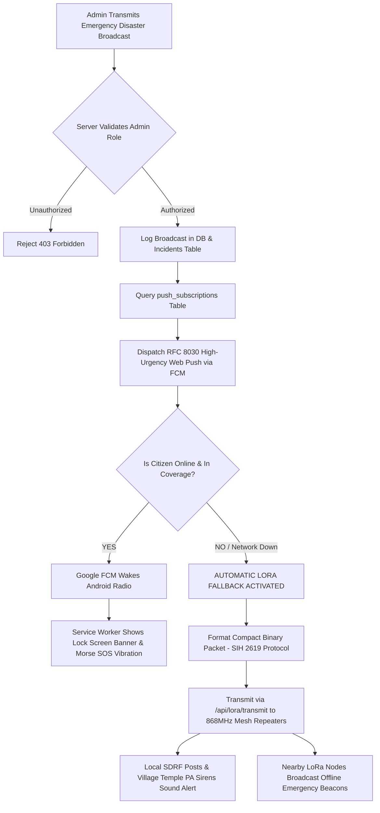

# Project Rakshak: Authentication, Role-Based Access Control (RBAC) & Alert Delivery Specification

> **Document Version:** 1.0.0  
> **Target Audience:** Claude / Senior Full-Stack Engineer  
> **Implementation Scope:** User Signup/Login, Admin Privileges, Page Access Guards, Safe Zone Map Guidance, and Network-to-LoRa Fallback.  
> **Status:** Specification Document (Do not modify existing code until explicitly prompted with `proceed`).

---

## 1. Executive Summary & Objective

Currently, Project Rakshak operates in an open prototype state where administrative controls and broadcast triggers are exposed to all users, and pages lack user identity gating.

This specification outlines the end-to-end implementation of:
1. **User Authentication & Role Segregation:**
   - **Admin:** Pre-seeded superuser account for state emergency command officers. Full access to War Room (`dashboard.html`), Evacuation Hub (`evacuation.html`), AI Simulator (`simulator.html`), LoRa Console (`lora.html`), and Mass Broadcast Transmission.
   - **Citizen:** Public user registering with Gmail and password. Restricted strictly to Citizen Emergency SOS (`citizen.html`) and Safe Zone Hazard Navigation on (`map.html`). All administrative panels are completely hidden and guarded against unauthorized access.
2. **Notification Pipeline Separation:**
   - Removal of "Send Alert" triggers from normal citizen pages.
   - Centralization of all broadcast triggers inside the Admin Personal Dashboard.
3. **"Safe Zone Near Me" Citizen Guidance:**
   - Automatic calculation of nearest relief camp / high-ground haven based on citizen live GPS, displaying route guidance during active flood emergencies.
4. **Hybrid Delivery Pipeline (Web Push to LoRa Fallback):**
   - Online users receive high-priority Web Push (Google FCM).
   - Offline / out-of-coverage areas automatically receive emergency broadcasts via physical LoRa Mesh radio relays (`/api/lora/transmit`) and localized sirens.

---

## 2. Authentication & Database Architecture

### 2.1 Pre-seeded Admin Credentials
The admin account will be automatically seeded into the database on backend startup if it does not already exist:
- **Email:** `ayushsharma.cseaiml2026@ritroorkee.com`
- **Password:** `ashu@123`
- **Role:** `ADMIN`
- **Designation:** State Emergency Operations Center (SEOC) Chief Commander

### 2.2 Database Schema: `users` Table
To be added to [`backend/core/database.py`](file:///c:/Users/rikwa/rakshak-new/backend/core/database.py):

```sql
CREATE TABLE IF NOT EXISTS users (
    id INTEGER PRIMARY KEY AUTOINCREMENT,
    email TEXT UNIQUE NOT NULL,
    password_hash TEXT NOT NULL,
    salt TEXT NOT NULL,
    role TEXT NOT NULL DEFAULT 'CITIZEN', -- 'ADMIN' or 'CITIZEN'
    full_name TEXT NOT NULL,
    phone TEXT,
    created_at TEXT NOT NULL,
    last_login TEXT
);
```

### 2.3 Password Security & Hashing
To prevent external dependency conflicts, hashing will use standard Python `hashlib` with PBKDF2-HMAC-SHA256:
```python
import hashlib
import secrets

def hash_password(password: str, salt: str = None) -> tuple[str, str]:
    if not salt:
        salt = secrets.token_hex(16)
    key = hashlib.pbkdf2_hmac('sha256', password.encode('utf-8'), salt.encode('utf-8'), 100000)
    return key.hex(), salt

def verify_password(password: str, salt: str, password_hash: str) -> bool:
    key, _ = hash_password(password, salt)
    return key == password_hash
```

---

## 3. Backend API Endpoints to Implement

A new router file `backend/api/routes/auth.py` will be mounted under `/api/auth`:

### 3.1 `POST /api/auth/signup` (Citizen Registration)
- **Access:** Public
- **Request Body:**
  ```json
  {
    "full_name": "Rohan Sharma",
    "email": "rohan@gmail.com",
    "password": "user_password_here",
    "phone": "+91 98765 43210"
  }
  ```
- **Validation:**
  - Check if email already exists in `users` table -> 400 Bad Request (`"Email already registered"`).
  - Password length >= 6 characters.
- **Action:** Inserts new row with `role = 'CITIZEN'`. Returns user details and session token.

### 3.2 `POST /api/auth/login` (Unified Login for Admin & Citizens)
- **Access:** Public
- **Request Body:**
  ```json
  {
    "email": "ayushsharma.cseaiml2026@ritroorkee.com",
    "password": "ashu@123"
  }
  ```
- **Action:**
  - Verifies credentials against `users` table.
  - Generates signed session token (or JWT / secure random session token stored in SQLite or memory).
  - Returns:
  ```json
  {
    "success": true,
    "token": "session_token_xyz...",
    "user": {
      "id": 1,
      "email": "ayushsharma.cseaiml2026@ritroorkee.com",
      "full_name": "SEOC Commander Ayush",
      "role": "ADMIN"
    },
    "redirect": "dashboard.html"  // For ADMIN -> 'dashboard.html', for CITIZEN -> 'citizen.html'
  }
  ```

### 3.3 `GET /api/auth/me` (Session Verification)
- **Headers:** `Authorization: Bearer <token>`
- **Returns:** Current logged-in user profile, role, and active permissions.

### 3.4 `POST /api/auth/logout`
- **Action:** Invalidates active session token.

---

## 4. Role-Based Access Control (RBAC) & Page Guard Matrix

### 4.1 Page Permission Matrix

| Page File | Purpose | Citizen Access | Admin Access | Unauthenticated Guest |
| :--- | :--- | :---: | :---: | :---: |
| `index.html` | Portal Entry / Login & Signup Tabs | ✅ Allowed | ✅ Allowed | ✅ Allowed |
| `citizen.html` | Citizen SOS, Help Request, Community Radar | ✅ Allowed | ✅ Allowed | ❌ Redirect to `index.html` |
| `map.html` | GIS Hazard Map & Safe Zone Navigation | ✅ Allowed *(Citizen Safe Mode)* | ✅ Full Tactical *(All 115 Sectors & Relays)* | ❌ Redirect to `index.html` |
| `dashboard.html` | Command War Room, River Gauges, SDRF Units | ❌ **FORBIDDEN (403)** | ✅ Full Access | ❌ Redirect to `index.html` |
| `alerts.html` | Multi-Channel Broadcast Center & Synthesizer | ❌ **FORBIDDEN (403)** | ✅ Full Access | ❌ Redirect to `index.html` |
| `evacuation.html`| Four-Stage Evacuation Dispatch & Buses | ❌ **FORBIDDEN (403)** | ✅ Full Access | ❌ Redirect to `index.html` |
| `simulator.html` | Cloudburst & Breach Hydrodynamic Sandbox | ❌ **FORBIDDEN (403)** | ✅ Full Access | ❌ Redirect to `index.html` |
| `lora.html` | Physical LoRa Mesh Node Console & RF Sniffer | ❌ **FORBIDDEN (403)** | ✅ Full Access | ❌ Redirect to `index.html` |

### 4.2 Frontend Route Guard (`app.js`)
On every page load, a global guard checks:
```javascript
function enforceRBAC() {
    const publicPages = ['index.html', 'login.html', 'register.html'];
    const citizenAllowedPages = ['citizen.html', 'map.html'];
    const currentPage = window.location.pathname.split('/').pop() || 'index.html';

    if (publicPages.includes(currentPage)) return;

    const authData = JSON.parse(localStorage.getItem('rakshak_auth') || 'null');
    if (!authData || !authData.token) {
        window.location.href = `index.html?redirect=${currentPage}`;
        return;
    }

    // If logged in as CITIZEN and tries to access ADMIN page:
    if (authData.role === 'CITIZEN' && !citizenAllowedPages.includes(currentPage)) {
        alert("Access Denied: Administrative command center is restricted to SEOC Officers.");
        window.location.href = 'citizen.html';
    }
}
```

### 4.3 Mobile Bottom Navigation Bar Adaptation
- **For Citizens:** The bottom bar only displays:
  - `SOS` (`citizen.html`)
  - `Safe Map` (`map.html`)
  - `Profile / Logout`
  *(War Room, Alerts, and Routes links are stripped completely)*
- **For Admins:** Full 5-tab tactical menu:
  - `SOS Monitor`, `Tactical Map`, `War Room`, `Alert Broadcast`, `Routes`.

---

## 5. Notification System Re-architecture

### 5.1 Removal from Citizen Interface (`citizen.html`)
- **Remove:** The button labeled `"Send Emergency Test Alert to My Phone"`.
- **Replace With:** A clean enrollment widget:
  - `"Emergency Broadcasts Status: [Active / Enabled]"`
  - Description: *"Your device is registered with SEOC Dehradun. You will receive high-urgency alarms if your sector is threatened."*
  - No capability for citizens to trigger mass notifications.

### 5.2 Centralized Broadcast Controls in Admin Profile / Dashboard
- In `dashboard.html` (Top Header / Incident Feed) and `alerts.html`:
  - Dedicated **"Emergency Broadcast Dispatcher"** panel.
  - Buttons:
    1. **"⚡ Send Mass Alarm to All Citizens"** (Pushes to all records in `push_subscriptions`).
    2. **"Localized Threat Blast"** (Targets citizens within a specific risk radius or city).
  - Strict server-side verification: Only users with `role == 'ADMIN'` in their session token can invoke `/api/alerts/broadcast` or `/api/alerts/phone-test`.

---

## 6. "Safe Zone Near Me" Automated Guidance (`map.html`)

When a citizen opens `map.html` during a disaster warning or taps "Where should I go?":

1. **GPS Detection:**
   The browser acquires `navigator.geolocation.getCurrentPosition()`.
2. **Shelter Proximity Calculation:**
   The frontend queries all pre-positioned SDRF forward relief shelters and safe havens:
   ```javascript
   const SAFE_HAVENS = [
       { name: "Sonprayag SDRF Staging Camp", lat: 30.6300, lng: 78.9980, elevation: 1820, capacity: 500, phone: "1077" },
       { name: "Guptkashi High Ground Community Center", lat: 30.5229, lng: 79.0777, elevation: 1319, capacity: 1200, phone: "1070" },
       { name: "Joshimath Military Station Relocation Hub", lat: 30.5564, lng: 79.5630, elevation: 1890, capacity: 800, phone: "0135-2410882" },
       { name: "Gauchar Airfield Relief Depot", lat: 30.2922, lng: 79.1558, elevation: 800, capacity: 2500, phone: "112" }
   ];
   ```
3. **Haversine Distance Formula:**
   Calculates the closest haven and estimated walking/driving duration.
4. **Interactive HUD Banner:**
   A high-contrast emergency card displays at the top of the citizen map:
   > 🏃 **NEAREST SAFE ZONE:** Sonprayag SDRF Camp (1.2 km away — High Ground)  
   > **Action:** Climb uphill via NH-107 Bypass. Avoid riverbed contour!  
   > `[Navigate via Google Maps]` `[Call Shelter In-Charge: 1077]`
5. **Map Visualization:**
   Draws an emerald safety vector line from citizen GPS directly to the shelter coordinate, marked with a pulsing shield icon.

---

## 7. Hybrid Alert Delivery Matrix (Web Push to LoRa Fallback)



### 7.1 LoRa Automatic Trigger Payload
When `/api/alerts/broadcast` is invoked by Admin, the backend will automatically call `dispatch_lora_emergency_packet()`:
- **RF Band:** 868.1 MHz (India License-Free ISM band)
- **Packet Structure:**
  ```
  [HEADER: 0x534F53] | [SECTOR_ID: 2 bytes] | [RISK_LEVEL: 1 byte] | [GEO_HASH: 4 bytes] | [CRC16: 2 bytes]
  ```
- This ensures that even if cellular base stations (BTS) and fiber lines wash away in a cloudburst, community loudspeaker relays and forward defense posts receive the alert.

---

## 8. Implementation Checklist for Claude / Developer

When the user gives the command `proceed`, execute these steps in order:

- [ ] **Step 1: Database Migration (`backend/core/database.py`)**
  - Add `users` table schema to `init_db()`.
  - Add pre-seeded Admin account check (`ayushsharma.cseaiml2026@ritroorkee.com` / `ashu@123`).
  - Add password hashing and verification helper functions.

- [ ] **Step 2: Authentication Routes (`backend/api/routes/auth.py`)**
  - Implement `/api/auth/signup`, `/api/auth/login`, `/api/auth/me`, `/api/auth/logout`.
  - Mount router in `main.py`.

- [ ] **Step 3: Portal Login & Registration UI (`public/index.html`)**
  - Provide a toggle tab: **"Citizen Access"** vs **"Officer Command Login"**.
  - Add Citizen Signup modal (Full Name, Phone, Email, Password).
  - Admin login tab pre-validates against Admin credentials.
  - On login, store session in `localStorage.setItem('rakshak_auth', ...)` with role.

- [ ] **Step 4: Role-Based Route Guards (`public/app.js`)**
  - Implement `enforceRBAC()` on all page scripts.
  - Restrict Citizens from viewing `dashboard.html`, `alerts.html`, `evacuation.html`, `simulator.html`, `lora.html`.
  - Filter mobile bottom navigation bar based on `authData.role`.

- [ ] **Step 5: Citizen UI Cleanup (`public/citizen.html`)**
  - Remove "Send Alert to Phone" button.
  - Retain only "Enable Notifications" / "Screen-Off Status".

- [ ] **Step 6: Admin Broadcast Controls (`public/dashboard.html` & `public/alerts.html`)**
  - Ensure broadcast trigger buttons are only accessible to Admin.
  - Connect Admin broadcast to both WebPush and LoRa Mesh dispatch.

- [ ] **Step 7: "Safe Zone Near Me" on Map (`public/map.html`)**
  - Add Nearest Haven calculation algorithm and floating emergency evacuation banner.

- [ ] **Step 8: End-to-End Verification**
  - Test Admin login with `ayushsharma.cseaiml2026@ritroorkee.com` / `ashu@123`.
  - Test Citizen signup and login with a new Gmail address.
  - Verify Citizen cannot navigate to `dashboard.html` (auto-redirected to `citizen.html`).
  - Verify Admin can broadcast notification to all devices.
