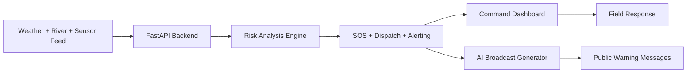

# Rakshak

Disaster intelligence and emergency coordination platform for Uttarakhand’s SEOC operations.

## Overview

Rakshak helps teams monitor risks, manage SOS alerts, coordinate field response, and send time-critical public warnings from a single operational dashboard.

## Workflow



## Key capabilities

- Real-time river and weather monitoring
- SOS intake and triage
- Field unit dispatch coordination
- Risk simulation and hazard scoring
- AI-generated emergency alerts
- Safe-route and disaster planning
- LoRa / TTN telemetry support

## Project structure

```text
rakshak-new/
├── main.py                 # FastAPI backend
├── streamlit_app.py        # Analytics dashboard
├── start.py                # Startup helper
├── requirements.txt        # Python dependencies
├── .env.example            # Environment template
├── public/                 # Web frontend pages
├── backend/
│   ├── api/routes/         # Route handlers
│   ├── core/               # DB + shared logic
│   ├── services/           # Weather, AI, routing, LoRa
│   ├── tasks/              # Background jobs
│   └── cache/              # Cache helpers
├── rakshak.db              # SQLite database
├── rakshak.log             # Runtime logs
└── README.md
```

## Tech stack

- Python + FastAPI
- SQLite
- Streamlit + Plotly
- HTML + JavaScript
- Google Gemini AI
- Open-Meteo API
- LoRa / TTN integrations

## Setup

### 1. Create virtual environment

```powershell
cd C:\Users\rikwa\rakshak-new
python -m venv .venv
.\.venv\Scripts\Activate.ps1
python -m pip install --upgrade pip
```

### 2. Install dependencies

```powershell
pip install -r requirements.txt
```

### 3. Add environment variable

```powershell
copy .env.example .env
```

```env
GEMINI_API_KEY=your_gemini_api_key_here
```

> Without this key, the app uses built-in fallback emergency templates.

## Run

### Backend

```powershell
python -m uvicorn main:app --host 0.0.0.0 --port 3000
```

Access:
- http://localhost:3000
- http://localhost:3000/api/docs

### Analytics dashboard

```powershell
streamlit run streamlit_app.py --server.port 8501
```

Access:
- http://localhost:8501

### Startup helper

```powershell
python start.py
```

## Main API endpoints

- GET /api/health
- GET /api/state
- GET /api/field-units
- POST /api/sos
- POST /api/sos/update
- POST /api/simulate
- POST /api/dispatch
- GET /api/routes/safe
- GET /api/lora/nodes
- POST /api/integrations/ttn/uplink
- GET /api/docs

## Use cases

- District control room monitoring
- Flood and landslide risk assessment
- SOS handling and responder assignment
- Emergency broadcast generation
- Crisis simulation and training drills

## Status

This project is designed as an operational disaster-response command platform for Uttarakhand-focused monitoring, alerting, dispatch coordination, and analytics.

